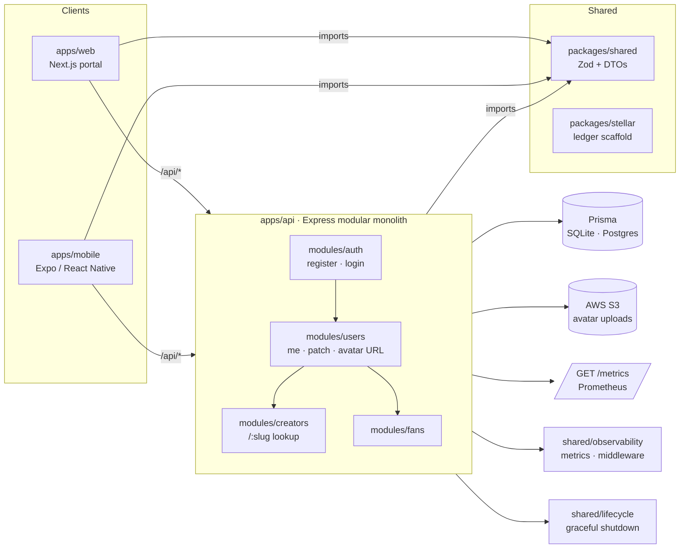

# Architecture

> How Universal Healthcare Data Network is wired together — monorepo topology, the Express modular monolith convention, and how frontend, mobile, and shared packages consume the same contract layer.

[Back to README](../README.md) · [Contributing](./contributing.md) · [Testing](./testing.md) · [Environment](./environment.md)

---

## Why this shape

UHDN is a **pnpm + Turborepo** monorepo. Every package — `api`, `web`, `mobile`, `shared`, `stellar` — is built and tested in isolation but shares a single source of truth: the Zod schemas and DTOs exported from `@universal-healthcare/shared`. That contract layer is the reason we can ship a new endpoint and have both the React form and the React Native client validate it on the same terms.

Design principles:

- **Modular monolith** at the API layer — one Express app, many independent modules. Each module owns its routes, services, repository, validators, and tests.
- **Shared workspace package** consumed directly from TypeScript source — no compile step, no drift.
- **Per-package CI** under `.github/workflows/` — a PR for `apps/api` only runs the api workflow.

---

## Monorepo layout

```txt
universal-healthcare-data-network/
├── apps/
│   ├── api/        @universal-healthcare/api     – Express modular monolith
│   ├── web/        @universal-healthcare/web     – Next.js (App Router) portal
│   └── mobile/     @universal-healthcare/mobile  – Expo (React Native) client
│
├── packages/
│   ├── shared/     @universal-healthcare/shared  – Zod schemas, DTOs, validators
│   └── stellar/    @universal-healthcare/stellar – ledger integration scaffold
│
├── docs/                – this documentation set
├── tools/               – developer tooling (publish-backlog, etc.)
└── README.md
```

`packages/shared` is consumed from source by both `apps/api` and `apps/web`. The Next.js config also lists it in `transpilePackages` so it works transparently in App Router without a build step.

---

## Module flow



**Read this diagram as:** clients call HTTP, the API dispatches to modules, modules share state through the `users` service (the only owned persistable entity), the contract layer sits underneath all of it, and storage fans out to Prisma and S3.

---

## Backend — `apps/api`

`apps/api` is an Express app organized as a **modular monolith**. Every domain lives in its own module under `src/modules/<domain>/` with a consistent internal structure:

```txt
src/modules/<domain>/
├── controllers/   – request/response handling, calls into services
├── services/       – business logic (validation, orchestration, returns AppError)
├── repositories/   – Prisma persistence  (only if the module owns its rows)
├── validators/     – zod schemas for request bodies / params
├── routes/         – Express Router
├── types/          – module-local types and DTOs
└── tests/          – vitest + supertest, scoped to that module
```

Cross-cutting concerns live under `src/shared/`:

```txt
src/shared/
├── config/        – env loading + zod validation
├── database/      – Prisma client singleton
├── errors/        – AppError and family
├── logger/        – JSON-structured application logger
├── middleware/    – Express middleware (auth, error handler, request-id, request-logger, rate limit)
├── observability/ – Prometheus metrics registry + metrics middleware
├── lifecycle/     – graceful shutdown on SIGTERM / SIGINT
├── storage/       – S3 client + presigned URL helpers
└── types/         – global type augmentations (e.g. Express Request)
```

### Current modules

| Module       | Routes                                                 | Status     |
| ------------ | ------------------------------------------------------ | ---------- |
| `auth`       | `POST /api/auth/register` · `POST /api/auth/login`    | ✅ shipped |
| `users`      | `GET /api/users/me` · `PATCH /api/users/me` · `POST /api/users/me/avatar-upload-url` | ✅ shipped |
| `creators`   | `GET /api/creators/:slug`                              | ✅ shipped |
| `fans`       | `GET /api/fans/me` · `PUT /api/fans/me` · `PATCH /api/fans/me` · `PUT /api/fans/me/genre-prefs` | ✅ shipped |

Module rule: modules call **each other's services**, not each other's repositories. This keeps persistence ownership explicit and makes it cheap to swap Prisma or DB out later.

### Adding a new module

1. Create `src/modules/<domain>/` with the structure above. Only add the subdirectories the module needs — a read-only module can omit `repositories/`.
2. Define request/response types in `types/` and validation schemas in `validators/`. **Reuse `@universal-healthcare/shared` schemas** when the same shape is consumed by the frontend.
3. Implement business logic in `services/`. Throw `AppError(status, code, message)` for domain failures — never throw raw strings.
4. Wire `routes/` and **mount the router in `src/app.ts`** so it's reachable.
5. Add `tests/` mirroring the `auth` module template: success path, duplicate/conflict, validation failure, and the require-auth middleware behaviour if protected.

### Cross-cutting helpers

| Helper                       | Where                                           |
| ---------------------------- | ----------------------------------------------- |
| `AppError`                   | `src/shared/errors/app-error.ts`                |
| `env` (zod-validated)        | `src/shared/config/env.ts`                      |
| `logger` (JSON structured)   | `src/shared/logger/logger.ts`                   |
| `requireAuth` middleware     | `src/shared/middleware/auth.middleware.ts`      |
| `requestId` middleware       | `src/shared/middleware/request-id.middleware.ts`|
| `requestLogger` middleware   | `src/shared/middleware/request-logger.middleware.ts` |
| `buildRateLimiter`           | `src/shared/middleware/rate-limit.middleware.ts`|
| `metricsMiddleware` + `metricsSnapshot` | `src/shared/observability/`           |
| `installGracefulShutdown`    | `src/shared/lifecycle/graceful-shutdown.ts`     |
| `createAvatarUploadUrl` (S3) | `src/shared/storage/s3.ts`                      |

See [Environment](./environment.md) for the env variables these consume.

---

## Frontend — `apps/web`

A **Next.js (App Router)** portal. Authenticated routes read from `AuthProvider` / `useAuth` (`lib/auth-context.tsx`); API calls go through the typed `lib/auth-client.ts`, `lib/user-client.ts`, and `lib/creator-client.ts`. Form validation is client-side via the same Zod schemas the API uses server-side — so a mismatch fails loudly during dev, not in production.

Existing routes:

- `/` — landing + login state
- `/register`, `/login` — auth flows
- `/profile/edit` — self-service profile update (creator *or* fan)
- `/creators/[slug]` — public creator page

---

## Mobile — `apps/mobile`

A **React Native / Expo** shell. The `src/` directory is pre-structured for future feature work:

```txt
apps/mobile/src/
├── components/      # ProfileImagePicker and friends (cross-screen)
├── screens/         # CreatorProfileScreen, etc.
├── navigation/      # Future: route graph
├── hooks/           # useImagePicker, etc.
├── services/        # api-client, creator-service
├── utils/
└── assets/          # bundler-resolved images
```

Today `App.tsx` renders a single Expo placeholder; the rest of the surface is ready for feature work.

---

## Shared packages

| Package           | Purpose                                                                                    |
| ----------------- | ------------------------------------------------------------------------------------------ |
| `packages/shared` | Single source of truth for Zod schemas (`loginSchema`, `registerSchema`, `updateMeSchema`) and DTOs (`AuthResponse`, `MeResponse`, `CreatorProfileResponse`, `FanProfileResponse`). |
| `packages/stellar`| Compile-only scaffolding for a future Stellar payment / data-provenance layer. Exports placeholder types (`StellarAccountReference`, `StellarNetworkConfig`) and the `StellarPaymentClient` interface — no blockchain calls yet. |

When a schema in `@universal-healthcare/shared` changes, every consumer — API, web, mobile — breaks loudly through TypeScript. That's the point.

---

## What to read next

- **Building a new API endpoint?** → jump to [Adding a new module](#adding-a-new-module).
- **Wiring an env-backed feature?** → [Environment](./environment.md).
- **Adding or updating tests?** → [Testing](./testing.md).
- **Submitting a PR?** → [Contributing](./contributing.md).
